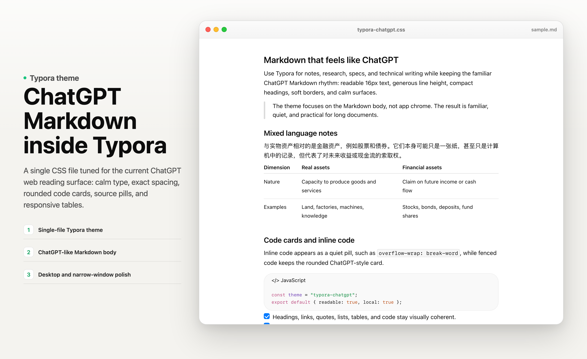
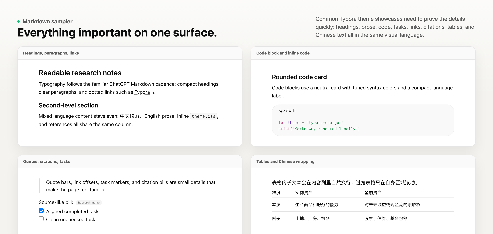
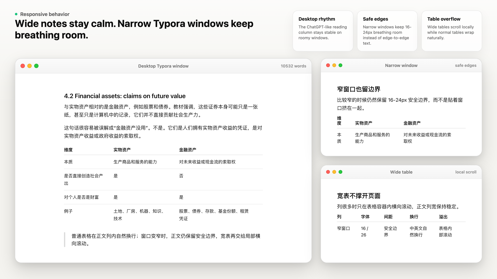

# Typora ChatGPT

一个把 ChatGPT 官网 Markdown 阅读风格带到 Typora 里的主题。

[](https://typora.io/)
[](./typora-chatgpt.css)
[](./LICENSE)



Typora ChatGPT 是一个单 CSS 文件主题，目标是让本地 Typora 的 Markdown 阅读体验尽量贴近 ChatGPT 官网当前的 Markdown 正文效果。它关注正文区域：字体节奏、标题间距、inline code、代码块、引用、链接、来源 pill、任务列表、脚注和响应式表格。


[下载 MP4 演示视频](assets/video/typora-chatgpt-demo.mp4)

## 特点

- 不是普通的“聊天风”配色，而是贴近 ChatGPT 官网 Markdown 正文。
- 使用接近 ChatGPT 的系统字体节奏：16px 正文、26px 行高。
- 复刻灰色 inline code pill、24px 圆角代码卡和清爽语法色。
- 引用、任务列表、链接、脚注和来源 pill 都保持 ChatGPT 式克制风格。
- 窄窗口保留 16-24px 安全边界，避免内容贴边。
- 标准表格按正文列宽自然换行；宽表只在表格内部横向滚动，不撑开整个页面。
- 单文件安装，不需要构建、不需要插件、不依赖远程字体。

## 截图

### 主视觉


### Markdown 全组件展示



### 响应式逻辑



## 安装

1. 下载本仓库，或下载最新 release ZIP。
2. 打开 Typora。
3. 进入 `设置 / Preferences` -> `外观 / Appearance` -> `打开主题文件夹 / Open Theme Folder`。
4. 把 `typora-chatgpt.css` 复制到主题文件夹。
5. 重启 Typora。
6. 在菜单栏选择 `Theme` -> `Typora Chatgpt`。

### macOS 快速安装

```bash
mkdir -p "$HOME/Library/Application Support/abnerworks.Typora/themes"
curl -L https://raw.githubusercontent.com/Suehn/typora-chatgpt/main/typora-chatgpt.css \
  -o "$HOME/Library/Application Support/abnerworks.Typora/themes/typora-chatgpt.css"
```

执行后重启 Typora。

## 更新

用新版 `typora-chatgpt.css` 覆盖 Typora 主题文件夹中的旧文件，然后重启 Typora。

## 兼容性

已在 macOS 当前 Typora 编辑器 DOM 下测试。主题是纯 CSS，Windows 和 Linux 通常也可使用；如果 Typora 后续大幅调整编辑器 DOM，可能需要同步更新选择器。

## 设计说明

Typora ChatGPT 只关注 Markdown 正文渲染，不复制 ChatGPT 的产品界面、侧边栏、按钮或聊天控件。目标很明确：让 Typora 文档读起来像 ChatGPT 官网里的 Markdown 正文。

响应式表格遵循同一套逻辑：

- 宽窗口保持桌面内容列宽；
- 窄窗口保留可读边界；
- 普通表格在正文列内换行；
- 宽表只在自身容器内横向滚动。

## 文件结构

```text
typora-chatgpt.css              # 主题文件
assets/screenshots/             # README 截图
assets/video/                   # README 演示视频和 GIF
assets/preview/                 # 本地截图预览页
sample.md                       # 测试主题用的 Markdown 样例
```

## License

MIT License. See [LICENSE](./LICENSE).

ChatGPT 是 OpenAI 的商标。本项目是独立 Typora 主题，与 OpenAI 无关联。
